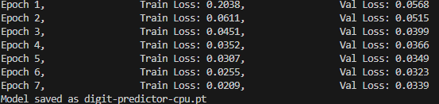

# 🧠 Digit Predictor with PyTorch & C++ Inference

Welcome to **Digit Predictor** – a simple but cool demo that shows how to train a PyTorch model in Python, run it in fast C++ and then... in android!  

It's not production code – just a **toy example** to help you get started with native inference using TorchScript. It’s great for learning how to bridge Python & C++ & Android.

## 🛠️ What’s Inside?

- ✅ A **PyTorch** training script (Python)
- ✅ A **C++ inference** program using **LibTorch**
- ✅ Preprocessing with OpenCV
- ✅ Digit classification from 28×28 grayscale images (MNIST-style) with simple CNN
- ✅ TorchScript serialization
- ✅ Android deployment

## 🧪 Prerequisites

To make things smooth, I **recommend** the following setup:

| Component       | Version         |
|----------------|-----------------|
| Python         | 3.8+            |
| PyTorch        | **2.5.1**       |
| LibTorch (C++) | **2.5.1 CPU**   |
| OpenCV (C++)   | Any recent      |
| Compiler       | MSVC            |

- ⚠️ Make sure your **LibTorch and PyTorch versions match exactly**. Mismatched versions may cause cryptic errors. 
- ⚠️ Also I used a debug CPU version of LibTorch.
- ⚠️ And don't forget to create a virtual environment: 
```bash
⦁ python -m venv torch_venv
⦁ Source torch_venv/scripts/activate
⦁ pip install torch torchvision torchaudio 
```

## 🧑‍🏫 How It Works

### 1. 🔧 Train & Save the Model (Python)

Run the training script to:

- Train a basic CNN on MNIST
- Export it as a TorchScript `.pt` file
- Save the model in **CPU format** for C++ inference

```bash
cd training
python train.py
```

This creates **model_cpu.pt** in your working directory

Training losses look like this: 

